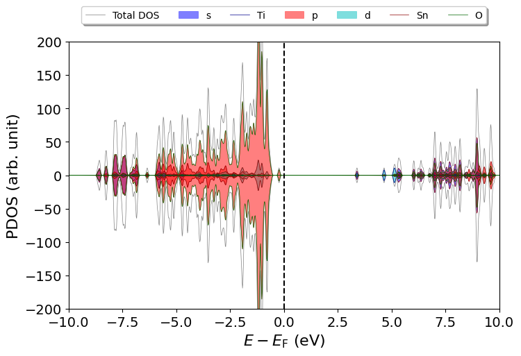
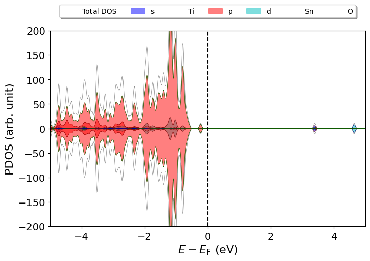
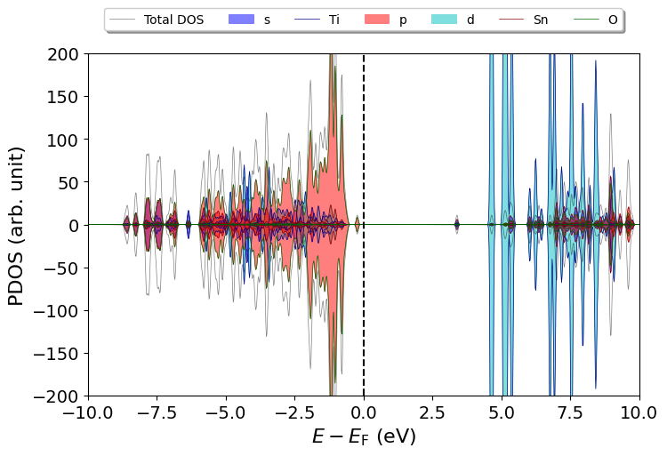

# DOS Analysis Tool

This repository contains a set of Python scripts for analyzing the density of states (DOS) from VASP output files. The scripts are designed to read `DOSCAR` and `POSCAR` files and automatically visualize the projected density of states (PDOS) data.


## Table of Contents

- [Installation](#installation)
- [Example Usage](#example_usage)
- [Contributing](#contributing)
- [License](#license)

## Installation

To use these scripts, you need to have Python installed on your system along with the following packages:

- `numpy`
- `matplotlib`

You can install the required packages using pip:

```bash
pip install numpy matplotlib
```

Put the folder in the Python path to ensure the scripts can be accessed and executed correctly.


## Example Usage

Go into a folder where `POSCAR` and `DOSCAR` are located, and just run:

```bash
show_me_dos.py
```


We can change the x, y limits by using:

```bash
show_me_dos.py -xy=-5:5,-200:200
```




Scale up the contribution of the first element by 100 times (This case is the doping of Ti in SnO2):

```bash
show_me_dos.py -f=100,1,1 
``` 



Here are the full list of things you can do:

```bash

usage: show_me_dos.py [-h] [-i INPUT] [-d DOSCAR_NAME_INPUT] [-xy XYRANGE] [-s SIZE] [-a ATOMS] [-f FACTOR] [--colors COLORS]
                      [-o ORBITAL] [--notsave] [--nosize] [--notshow] [--pdf] [--absolute]

options:
  -h, --help            show this help message and exit
  -i INPUT, --input INPUT
                        path: default $PWD
  -d DOSCAR_NAME_INPUT, --DOSCAR_name_input DOSCAR_NAME_INPUT
                        default DOSCAR
  -xy XYRANGE, --xyrange XYRANGE
                        DOS plot x axis range format:xa:xb,ya:yb
  -s SIZE, --size SIZE  figure size a,b
  -a ATOMS, --atoms ATOMS
                        atoms range a:b, or just a number
  -f FACTOR, --factor FACTOR
                        fator a,b,c,d .. match the atoms group
  --colors COLORS       colors a,b,c,d .. match the atoms group
  -o ORBITAL, --orbital ORBITAL
                        draw certain orbital
  --notsave             not save the plot
  --nosize              not change figure size
  --notshow             not show the plot
  --pdf                 save the plot in pdf
  --absolute            absolute energy scales
```
More detailed usage examples will be listed here later.
There are also many other functions are coming soon.

## Contributing

Contributions are welcome! Please feel free to submit a pull request or open an issue if you have any suggestions or improvements.


## License
This project is licensed under the MIT License. See the [LICENSE](./LICENSE) file for details.